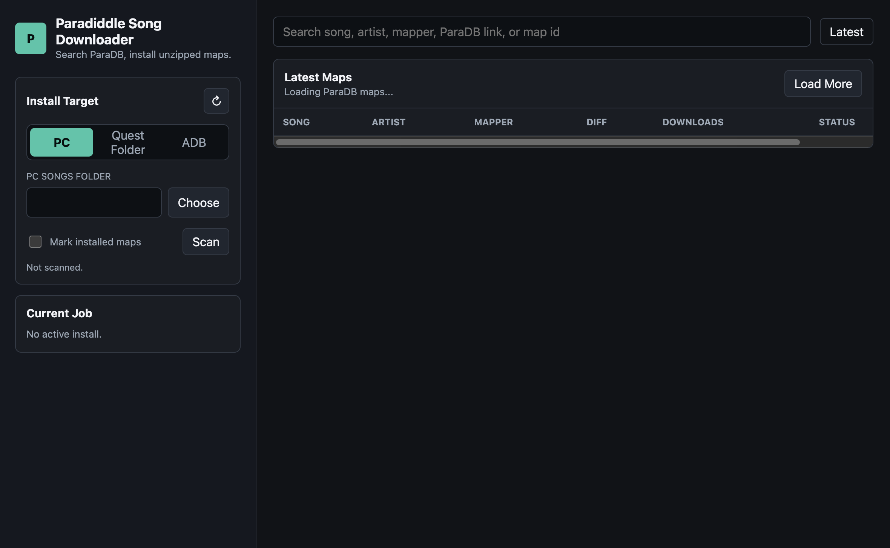

# Paradiddle Song Downloader

[](https://github.com/madmax-dev-br/paradiddle-song-downloader/actions/workflows/release.yml)

Electron app for searching [ParaDB](https://paradb.net/) and installing Paradiddle song maps unzipped.

## Print



## Run

```bash
npm install
npm start
```

## Install modes

- `PC`: downloads internally, extracts, then copies the song folder to `Documents/Paradiddle/Songs` or a folder you choose.
- `Quest Folder`: choose a mounted Quest path like `Quest/Internal Shared Storage/Paradiddle/Songs`; the app copies the extracted song folder there.
- `ADB`: if Android platform tools are installed and the Quest is authorized, the app pushes to `/sdcard/Paradiddle/Songs`.

## Installed map checks

Enable `Mark installed maps`, then press `Scan`. The app checks the active install target and marks matching ParaDB search rows as `Installed`.

The scan reads direct song folders under the selected `Paradiddle/Songs` folder. For mounted folders it also reads `.rlrr` filenames to improve title matching. For ADB mode it lists `/sdcard/Paradiddle/Songs` on the connected Quest.

## Find by link

Paste a ParaDB map link like `https://paradb.net/map/M3EA11F` or a map id like `M3EA11F` in the search box. The app auto-detects it after the debounce and loads that exact map.

## Build locally

```bash
npm run package:win
npm run package:mac:x64
npm run package:mac:arm64
```

The app queries ParaDB on demand through `GET /api/maps` and downloads individual map zips through `GET /api/maps/:id/download`.
